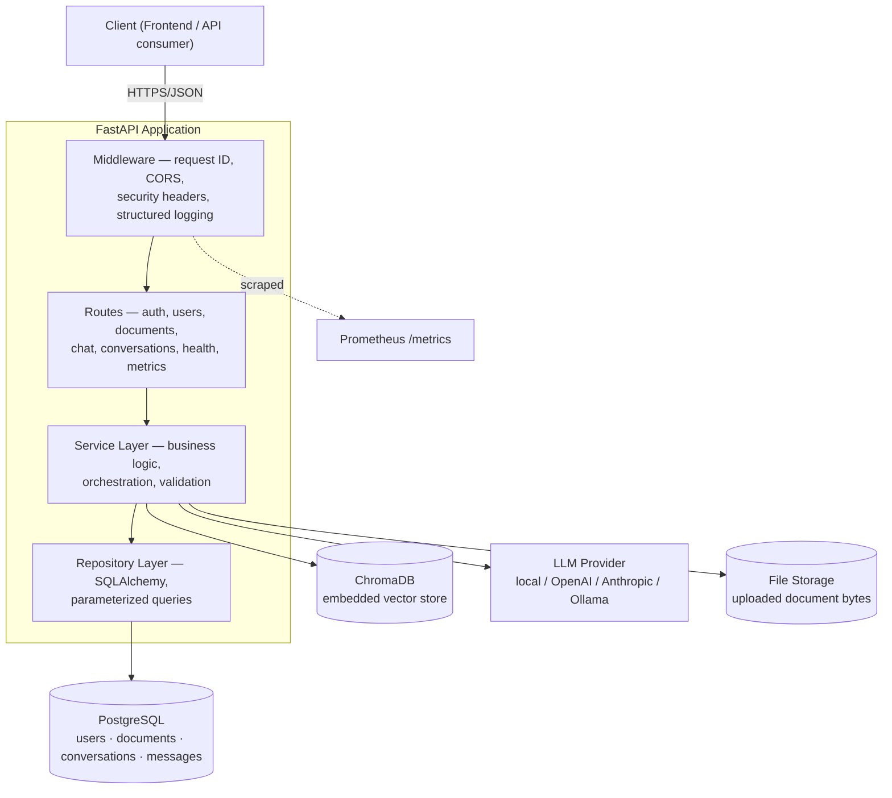
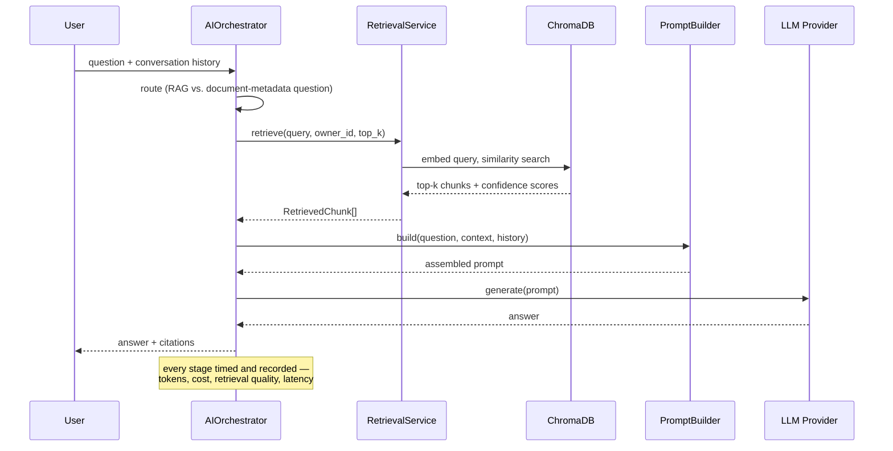
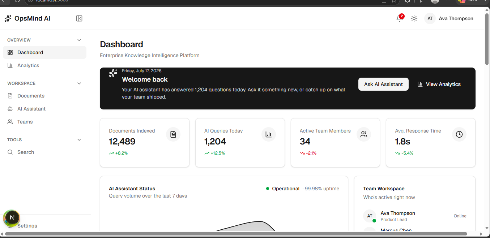
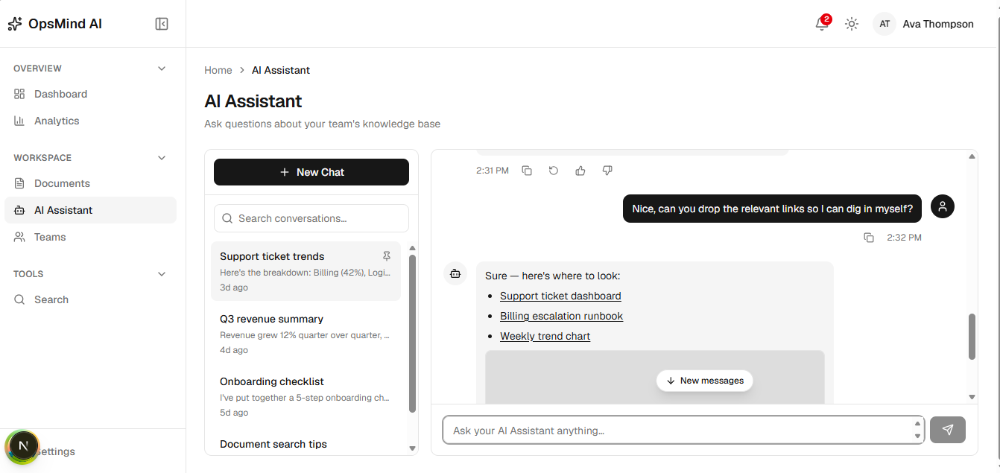
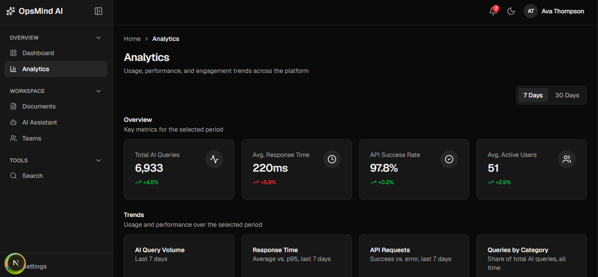
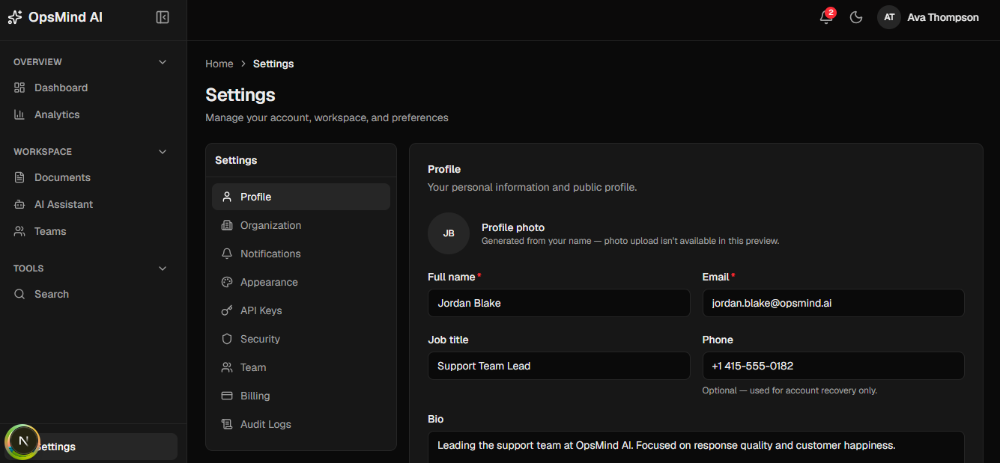

# OpsMind

**A production-shaped, Retrieval-Augmented Generation (RAG) platform** — teams upload documents, an AI assistant answers questions grounded in that content with citations, and every layer of the system (API, database, AI pipeline, containers, CI, security) is built and tested to the standard of a real engineering team, not a tutorial project.

OpsMind started as a frontend prototype and has since grown a complete, independently-designed backend: a real FastAPI service, a real RAG pipeline (embedding → vector search → prompt construction → LLM generation), a real Postgres schema with Alembic migrations, JWT authentication, Prometheus metrics, structured logging, Docker Compose orchestration, GitHub Actions CI, and a security-hardening pass — all backed by a **228-test suite** spanning unit, integration, API, database, and AI-pipeline layers.

> **Where this project actually stands**, honestly: the backend, AI pipeline, and testing/CI/observability/security infrastructure below are real, working, and verified — every claim in this README was checked against the running code, not written speculatively. The frontend (see [`frontend/`](frontend/)) is a complete, production-shaped Next.js application currently running against **mock data**; wiring it to the real backend is the single highest-leverage remaining task (see [Roadmap](docs/roadmap.md)).

---

## Table of Contents

- [Project Vision](#project-vision)
- [Features](#features)
- [Architecture Overview](#architecture-overview)
- [The AI Pipeline](#the-ai-pipeline)
- [Tech Stack](#tech-stack)
- [Getting Started](#getting-started)
- [Running with Docker](#running-with-docker)
- [Testing](#testing)
- [CI/CD](#cicd)
- [Observability](#observability)
- [Security](#security)
- [Screenshots](#screenshots)
- [Documentation](#documentation)
- [Roadmap](#roadmap)
- [Author](#author)

---

## Project Vision

Knowledge inside a growing team fragments across documents nobody can search and dashboards nobody trusts. OpsMind is a single workspace where a team's documents, an AI assistant grounded in those documents, and operational visibility into the AI itself all live behind one API — built specifically to demonstrate **production AI-systems engineering**, not just "call an LLM API": token budgeting, retrieval evaluation, cost tracking, database integrity, and a real CI/CD pipeline are first-class parts of the project, not afterthoughts.

## Features

- **Retrieval-Augmented Generation chat** — ask a question, get an answer grounded in your own uploaded documents, with per-chunk citations (document name + page number where available).
- **Document ingestion pipeline** — upload `.txt`/`.md`/`.pdf`, background-processed through extraction → chunking → embedding → vector indexing, with a pollable status endpoint (`uploaded → processing → embedding → ready`/`failed`).
- **Conversation memory** — multi-turn chat with token-budgeted history (not just a message-count cap), backed by real `Conversation`/`Message` tables.
- **Multi-provider LLM support** — local (free, no API key, CPU-friendly), OpenAI, Anthropic, and Ollama, swappable via one config value.
- **JWT authentication + RBAC** — bcrypt password hashing, role-based access control (`member`/`manager`/`admin`), anti-enumeration error responses.
- **AI observability** — token counts, estimated cost, retrieval quality (chunk count, confidence scores), and generation metadata tracked per request, exposed via Prometheus and an internal admin dashboard endpoint.
- **Production hardening** — rate limiting, CORS, security headers, dependency vulnerability scanning, file-upload validation, a startup check that refuses to boot with an insecure default secret.

## Architecture Overview



The backend follows a strict layered architecture — **routes** translate HTTP to plain Python calls, **services** own business rules and are the only layer AI orchestration and cross-cutting logic live in, **repositories** own persistence and nothing else. Every dependency (database session, storage backend, embedding model, LLM provider) is injected via FastAPI's `Depends()`, which is what makes the 228-test suite possible without a real Postgres, real ChromaDB network calls, or a single real LLM API call anywhere in CI. See [`docs/backend-architecture.md`](docs/backend-architecture.md) for the full breakdown.

## The AI Pipeline



Every stage is independently unit-tested against fakes (`FakeEmbeddingModel`, `FakeVectorStore`, `FakeLLM`), plus a **golden regression dataset** (`tests/test_golden_retrieval.py`) that catches retrieval-quality regressions a plumbing test can't. See [`docs/ai-pipeline.md`](docs/ai-pipeline.md) for the full design, including why token budgeting, retrieval evaluation, and cost estimation are treated as core engineering, not extras.

## Tech Stack

**Backend**
- [FastAPI](https://fastapi.tiangolo.com/) + [Uvicorn](https://www.uvicorn.org/) — async Python API
- [SQLAlchemy 2.0](https://www.sqlalchemy.org/) (async) + [Alembic](https://alembic.sqlalchemy.org/) — ORM + migrations
- [PostgreSQL](https://www.postgresql.org/) — primary datastore
- [ChromaDB](https://www.trychroma.com/) — embedded vector store
- [sentence-transformers](https://www.sbert.net/) — local embedding model
- [PyJWT](https://pyjwt.readthedocs.io/) + [bcrypt](https://github.com/pyca/bcrypt) — auth
- [Prometheus client](https://github.com/prometheus/client_python) — metrics

**AI**
- Local HuggingFace model (free, default) — [OpenAI](https://platform.openai.com/) / [Anthropic](https://www.anthropic.com/) / [Ollama](https://ollama.com/) supported via one config switch

**Testing & Quality**
- [pytest](https://pytest.org/) + [pytest-cov](https://pytest-cov.readthedocs.io/) — 228 tests across unit/integration/API/DB/AI-pipeline layers
- [Ruff](https://docs.astral.sh/ruff/) + [mypy](https://mypy-lang.org/) — lint + static typing
- [Locust](https://locust.io/) — load/stress/spike testing
- [pip-audit](https://pypi.org/project/pip-audit/) — dependency vulnerability scanning

**Infrastructure**
- [Docker](https://www.docker.com/) (multi-stage builds) + [Docker Compose](https://docs.docker.com/compose/) — backend, frontend, Postgres, Redis (provisioned ahead of use)
- [GitHub Actions](https://github.com/features/actions) — CI: lint → type-check → security scan → test+coverage → Docker build

**Frontend** *(complete, currently running against mock data — see [`frontend/README.md`](frontend/) for its own full documentation)*
- [Next.js](https://nextjs.org/) 16 (App Router) + [React](https://react.dev/) 19 + [TypeScript](https://www.typescriptlang.org/) (strict)
- [Tailwind CSS](https://tailwindcss.com/) v4, [Zustand](https://zustand-demo.pmnd.rs/), [TanStack Query](https://tanstack.com/query), [React Hook Form](https://react-hook-form.com/) + [Zod](https://zod.dev/)

## Getting Started

**Prerequisites:** Python 3.12+, PostgreSQL 16 (or use Docker — see below), Node.js 20+ (for the frontend).

```bash
git clone https://github.com/Kavisk46/Opsmind-ai.git
cd Opsmind-ai/backend

python -m venv .venv
.venv/Scripts/activate        # Windows; use `source .venv/bin/activate` on macOS/Linux

pip install -r requirements-dev.txt   # includes production deps + test/lint tooling
cp .env.example .env                  # edit DATABASE_URL if not using Docker's default

alembic upgrade head                  # apply database migrations
uvicorn main:app --reload             # http://localhost:8000
```

Interactive API docs (Swagger UI) are automatically available at `http://localhost:8000/docs` once running.

## Running with Docker

The whole stack — backend, frontend, Postgres, Redis (provisioned ahead of the caching feature that will use it) — via one command from the repository root:

```bash
cp .env.example .env      # review/override defaults, especially SECRET_KEY
docker compose build
docker compose up
```

Backend: `http://localhost:8000` · Frontend: `http://localhost:3000` · Postgres: `localhost:5432`

Both `backend/Dockerfile` and `frontend/Dockerfile` are multi-stage builds (dependency-install stage discarded from the final image, non-root user, health checks against real endpoints). See [`docs/deployment.md`](docs/deployment.md) for what each instruction does and why.

## Testing

```bash
cd backend
pytest -q                                                       # all 228 tests
pytest --cov=api --cov=core --cov=services --cov-report=term-missing   # with coverage
```

Tests are layered deliberately, not incidentally:

| Layer | What it proves | Real infra involved |
|---|---|---|
| Unit (services, AI pipeline) | Business logic, in isolation, via fakes | None |
| Repository / DB integration | Real constraints, cascades, transactions | SQLite (swapped in for tests) |
| API | Full request/response cycle, auth, validation | FastAPI TestClient |
| Golden retrieval | Retrieval doesn't silently regress | Real embedded ChromaDB |

Full breakdown, including *why* each layer exists and what it specifically catches that the others can't, in [`docs/testing.md`](docs/testing.md).

## CI/CD

Every push and pull request against `main` runs, in order: **Ruff → mypy → dependency vulnerability scan → pytest with coverage → Docker build** (`.github/workflows/ci.yml`) — fail-fast, cached dependencies, coverage uploaded as a build artifact. See [`docs/deployment.md`](docs/deployment.md#cicd).

## Observability

Every request is logged as structured JSON (request ID, method, path, status, duration) and every AI call is tracked separately (provider, model, tokens, estimated cost, retrieval chunk count/confidence) — exposed both as Prometheus metrics (`GET /metrics`) and a human-readable admin summary (`GET /internal/ai-metrics`, admin-only). `GET /health` and `GET /health/ready` distinguish liveness from real dependency readiness.

## Security

JWT auth with bcrypt hashing, role-based access control, CORS restricted to a real allowlist (never a wildcard), rate limiting on login and signup, file-upload content-type validation, security headers, a startup check that refuses to run with the default secret key outside development, and automated dependency vulnerability scanning in CI. Full security review and production checklist in [`docs/security.md`](docs/security.md).

## Screenshots

The frontend (complete, mock-data-backed today):

| Dashboard | AI Assistant |
|---|---|
|  |  |

| Analytics | Settings |
|---|---|
|  |  |

*Backend visuals — Swagger UI (`/docs`), a real `/chat` request/response, and the Prometheus metrics output — are straightforward to capture from a running instance and are the natural next addition here.*

## Documentation

| Doc | Covers |
|---|---|
| [`docs/architecture.md`](docs/architecture.md) | System, request-flow, and deployment diagrams |
| [`docs/backend-architecture.md`](docs/backend-architecture.md) | Layering, dependency injection, why each layer exists |
| [`docs/ai-pipeline.md`](docs/ai-pipeline.md) | Embedding → retrieval → prompt → generation, in depth |
| [`docs/api.md`](docs/api.md) | Full REST API reference |
| [`docs/deployment.md`](docs/deployment.md) | Docker, Compose, CI/CD |
| [`docs/testing.md`](docs/testing.md) | Testing strategy and how to run each layer |
| [`docs/security.md`](docs/security.md) | Security review and production checklist |
| [`docs/roadmap.md`](docs/roadmap.md) | What's done, what's next, honestly |
| [`docs/portfolio.md`](docs/portfolio.md) | Demo script, resume/portfolio blurbs, interview talking points |

## Roadmap

Highest-impact next step: **wire the frontend to the real backend** (the typed `ApiClient` and mock-service boundary were built for exactly this swap). Full roadmap, including what's genuinely done vs. planned, in [`docs/roadmap.md`](docs/roadmap.md).

## Author

**Kavimugil SK**
[LinkedIn](https://www.linkedin.com/in/kavimugil-sk) · [skkavi4618@gmail.com](mailto:skkavi4618@gmail.com)

Licensed under the [MIT License](./LICENSE).
