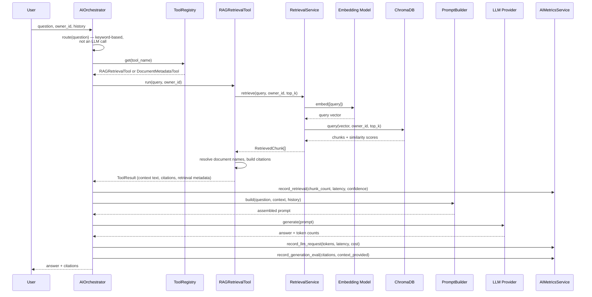

# The AI Pipeline

## Pipeline Diagram



## Why Routing Is Keyword-Based, Not an LLM Call

`AIOrchestrator._route()` decides between the RAG-retrieval tool and the document-metadata tool with a fixed keyword list, not a classification prompt to the LLM itself. Three reasons: it's deterministic and fully unit-testable with zero model involvement; it adds no latency or cost versus a second LLM round-trip; and the default local model has no reliable structured function-calling support to lean on. A stronger model or genuinely ambiguous routing needs would justify an LLM-based classifier later — that's a real upgrade path, not a correction of a mistake.

## Token Budgeting, Not Just a Message-Count Cap

Conversation history is truncated by **estimated token count** (`ConversationService.prepare_history_for_prompt()`), not just "last N messages" — a handful of long messages can consume far more of a model's context window than a dozen short ones, and a flat message-count cap can't tell the difference. A secondary, message-count cap in `PromptBuilder` still exists as a cheap defensive backstop in case the token estimate is ever wrong for some edge case — defense in depth, not redundancy. Token estimation itself is a simple `len(text) // 4` heuristic, deliberately not a real per-provider tokenizer — exactness isn't the goal; safely staying under budget is, without hard-coding a dependency on any one provider's exact tokenizer.

## Retrieval Evaluation

Every retrieval records **chunk count**, **latency**, and **confidence scores** (`AIMetricsService.record_retrieval()`), not just "did it succeed." A chunk count trending toward zero across many requests is the strongest available signal that retrieval itself is failing — either the embedding model or chunking strategy is producing poor matches, before any user ever explicitly complains. This is measured directly, empirically, via a **golden regression dataset** (`tests/test_golden_retrieval.py`): five realistic documents on distinct topics, five representative questions each paired with the one document it should retrieve, run against a real embedded ChromaDB with a deterministic-but-semantically-meaningful fake embedding model built specifically for this purpose (distinct from the length-based fake used everywhere else in the suite, which deliberately carries zero semantic signal and would make a golden set meaningless).

## Generation Evaluation — Honest Scope

`context_provided` and `citation_count` are recorded per answer as a proxy signal for possible hallucination risk — an answer produced via RAG retrieval with **zero** retrieved chunks is exactly the situation where the model had nothing real to ground on. This is explicitly *not* a real hallucination detector (that requires comparing generated text against retrieved context sentence-by-sentence, real research-grade work) — it's a cheap, honest substitute that flags every request where a hallucination was structurally possible, scoped appropriately for the project's size.

## Cost Estimation

`estimate_cost_usd()` uses a small, hardcoded price-per-1000-tokens table for a few known hosted models — explicitly an **approximation**, not a live billing integration, and returns `None` (never a misleading `0.0`) for local models or any model the table doesn't recognize. Good enough to answer "roughly how much is this costing," not good enough to reconcile against a real invoice.

## Provider Abstraction

```python
class LLMProvider(Protocol):
    async def generate(self, prompt: str) -> LLMResponse: ...
    def generate_stream(self, prompt: str) -> AsyncIterator[str]: ...
    @property
    def is_loaded(self) -> bool: ...
```

Four implementations (`local`, `openai`, `anthropic`, `ollama`) satisfy this same `Protocol`; `services/llm/factory.py` is the **only** place that decides which one to construct, based on config. `AIOrchestrator` and everything above it depends only on the `Protocol`, never a concrete class — swapping providers is a configuration change, never a code change. The local provider (default: `Qwen/Qwen2.5-0.5B-Instruct`) is free, runs in-process, and needs no API key — the deliberate default throughout this project, keeping the whole test suite and local development free of any external network dependency.

## What's Genuinely Tested vs. What Can't Be, Honestly

- **Fully unit-tested, real infra never touched**: `RetrievalService`, `PromptBuilder`, `AIOrchestrator`, all four LLM providers (mocked SDK clients), `RAGRetrievalTool`/`DocumentMetadataTool`.
- **Tested against real (but embedded/local) infrastructure**: `VectorStore` against a real, temp-dir ChromaDB — deliberately not faked, since a fake couldn't prove Chroma-specific translation logic (page-number sentinel handling, owner-scoped filtering) actually works.
- **Cannot be tested without a real model download**: `SentenceTransformerEmbeddingModel`'s actual embedding quality. What *is* tested: its lazy-loading contract (construction never touches the network) — the honest limit of what's testable without violating "never download models during tests."
