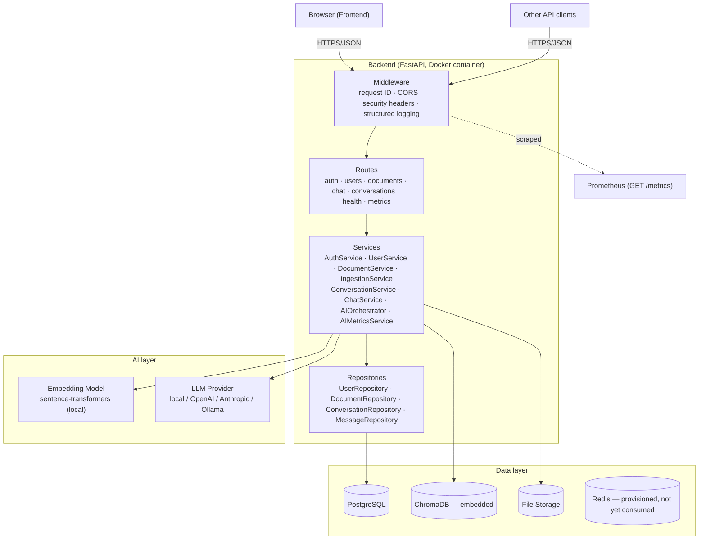
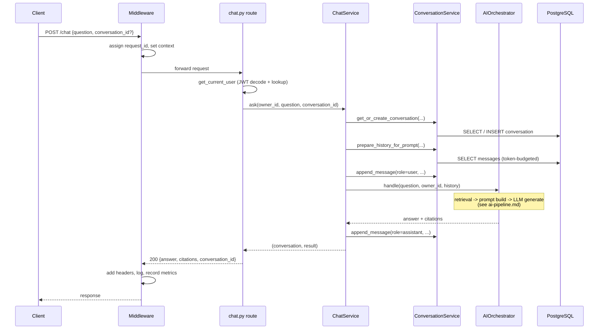

# System Architecture

This document contains the diagrams referenced from the root [README](../README.md), plus the reasoning behind each one. For layer-by-layer backend detail, see [`backend-architecture.md`](backend-architecture.md); for the AI pipeline specifically, see [`ai-pipeline.md`](ai-pipeline.md).

## System Architecture

**Why this shape.** Every arrow crossing a layer boundary goes through an explicit interface (a FastAPI `Depends()`, a repository method, a `Protocol`-typed service dependency) — never a direct import reaching across layers. That discipline is what makes the 228-test suite possible without a real Postgres, a real ChromaDB network call, or a single real LLM API call in CI: every one of those boxes has a fake or a swapped-in lightweight implementation (SQLite instead of Postgres, a temp-dir ChromaDB instead of a shared one, `FakeLLM` instead of a real provider) substituted at exactly the dependency-injection seam, with the code under test never knowing the difference.

## Request Flow — `POST /chat`

**Why history is fetched before the user's new message is persisted.** If the current question were saved first, `prepare_history_for_prompt()` would need to explicitly exclude it from the history it hands back to the LLM — fetching first makes "history never includes the turn currently being answered" true by construction, not by an extra filter that could be forgotten later.

## The AI Pipeline

See [`ai-pipeline.md`](ai-pipeline.md#pipeline-diagram) for the full sequence diagram and design rationale — reproduced briefly here for context: `question → route (RAG vs. metadata) → embed → vector search → prompt assembly → LLM generation → answer + citations`, with every stage timed and recorded (tokens, cost, retrieval confidence) via `AIMetricsService`.

## Deployment Architecture

```mermaid
graph TB
    subgraph Host["Docker host"]
        subgraph Network["opsmind-network (bridge)"]
            FE["frontend container<br/>Next.js standalone server :3000"]
            BE["backend container<br/>Uvicorn :8000"]
            PG["db container<br/>postgres:16-alpine :5432"]
            RD["redis container<br/>redis:7-alpine :6379"]
        end
        VolPG[("postgres_data volume")]
        VolStorage[("backend_storage volume")]
        VolChroma[("backend_chroma volume")]
        VolRedis[("redis_data volume")]
    end

    Dev["Developer's browser"]

    Dev -->|localhost:3000| FE
    Dev -->|localhost:8000| BE
    FE -.->|build-time only, NEXT_PUBLIC_API_URL| BE
    BE --> PG
    BE -.->|not yet consumed| RD
    PG --> VolPG
    BE --> VolStorage
    BE --> VolChroma
    RD --> VolRedis

    CI["GitHub Actions CI"] -.->|docker build, verification only| BE
```

**Why the frontend's browser calls go to `localhost:8000` directly, not through the frontend container.** `NEXT_PUBLIC_*` environment variables are inlined into the client-side JavaScript bundle at *build* time (see `frontend/Dockerfile`'s comment on this) — the code that actually calls the backend runs in the user's **browser**, not inside the `frontend` container, so it needs the backend's address as reachable from the host (`localhost:8000`, published by Compose), not the Docker-internal service name (`backend`) that only containers on `opsmind-network` can resolve. The backend's own `DATABASE_URL`, by contrast, is computed at container-runtime using the service name `db` — because that code genuinely runs inside the Docker network. Two different execution contexts, two different correct hostnames for reaching the same logical dependency — worth understanding precisely, not memorizing as a rule.
